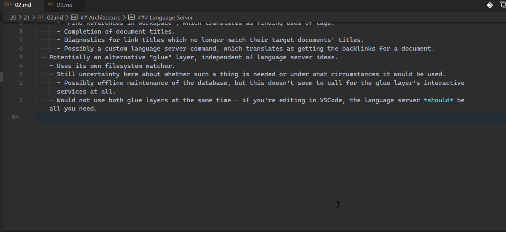

# zettel-language-server

A Language Server implementation to provide zettelkasten note-taking services for directories of Markdown documents.

## Features

### Completion for note titles

Image above also demonstrates my separate [VSCode extension](http://github.com/antonburger/zettel-tools) for using `Go to Definition` on links to other notes.

### Find references

Coming soon. At least for tags, and possibly for backlinks.
